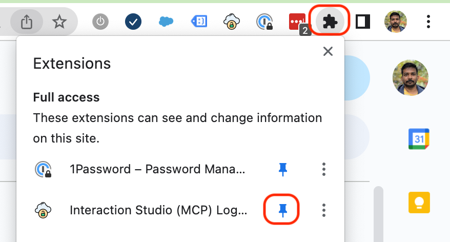
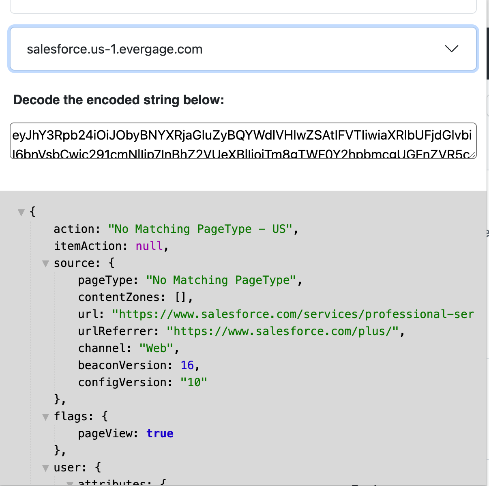

# Introduction: 
This addon logs all events that are sent to Salesforce's Marketing Cloud Personalization server by evergage.min.js beacon, and stores the event details in local storage. As the payload is base64 encoded, the add-on decodes it and displays a formatted JSON content that would be easy for developers and testers to debug the app.

## Installation instruction: 

1. Unzip the extension
2. Open chrome://extensions
3. Enable Developer mode
4. Click ‘Load Unpacked’ 
5. Pin the add-on

6. Open sites that have interaction studio. Example,
* Alc.ca
* Salesforce.com
* becu.org 
* macro.com.ar
* lendingclub.com 
* zebra.com 
7. When an event is recorded, the addon would change color for 5 seconds and it’ll be available in the addon's popup.

